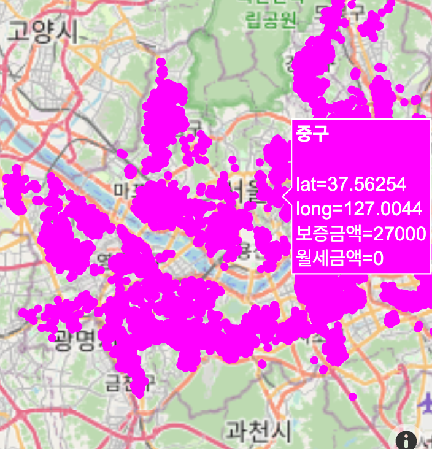
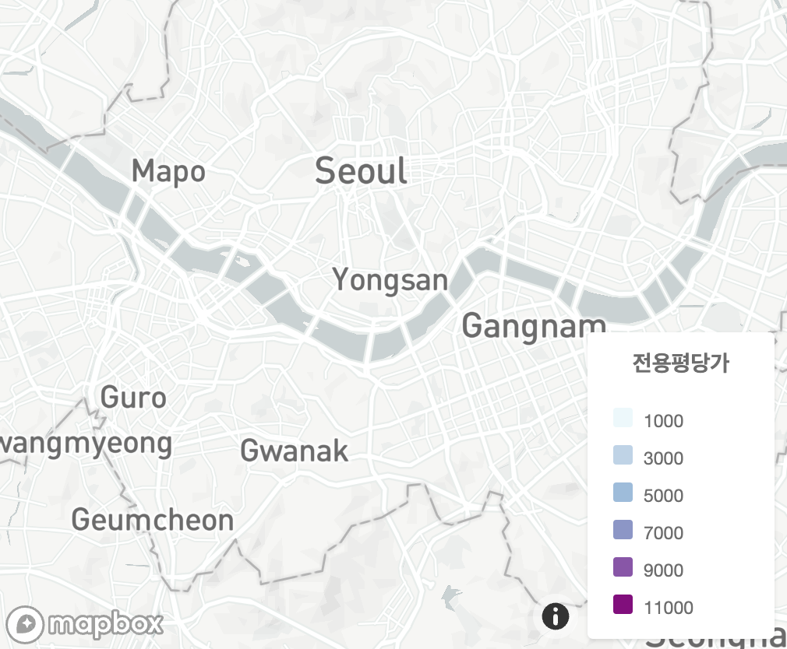
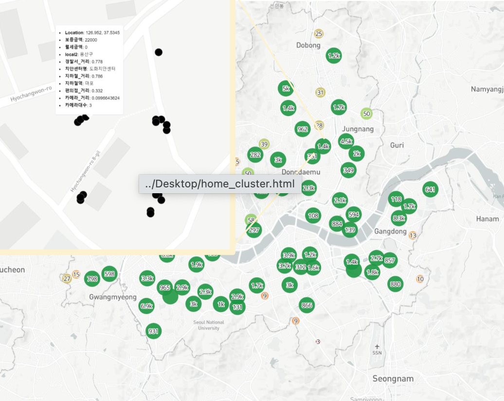

# 최근 서울시 원룸 데이터를 바탕으로 주변 환경을 고려한 시각화 프로젝트

## 프로젝트 참여 인원
> 이주환, 고상현, 박현석
- 이주환 : CCTV, 원룸 데이터, 관공서 데이터, 편의점 데이터 전처리, 원룸 기준 주요 시설 거리 계산 과 시각화
- 고상현 : 가공 된 데이터를 바탕으로 데이터 분석
- 박현석 : 자료 조사, 데이터 수집 및 데이터 취합

## 문제 정의
- 프로젝트 팀원들은 치안에 관련 된 뉴스와 기사를 많이 참고 하였고, 원룸 근처 치안률이 다른 주거 형태(아파트, 오피스텔)에 비해 안좋았다는 근거를 바탕으로 프로젝트를 진행 하였다.
* 직방, 다방, 네이버 부동산 등 부동산 플랫폼을 두고 봤을 때 근처 가까운 역, 경찰서, CCTV 개 수 등 편의 시설을 한 눈에 보기 어렵고 제공이 되지 않는 플랫폼도 존재 했다. 
- 모든 원룸의 정보를 제공하되 주요 시설 정보를 한 눈에 알아볼 수 있게 보여주는 시각화 프로젝트를 진행했다.

## 데이터 수집
- 공공데이터 포털 : 경찰청_전국 치안센터 주소 현황, 전국  CCTV표준데이터
- 직방 : 서울시 전/월세 데이터
- 서울 열린데이터 광장 : 수도권 지하철역 좌표 데이터, 편의점 정보 데이터

---
### 프로젝트에서 사용 된 설치용 라이브러리
- pandas, matplotlib, seaborn, numpy
- haversine, geopandas, folium, mapboxgl

### 데이터 전처리 과정
- 원룸 주변 편의점, 지하철, 경찰서, CCTV 거리 계산 
    - 원룸 및 주변 시설 위도/경도 추출
    - haversine 라이브러리를 이용 하여 원룸과 주변 시설간의 거리 계산
    - 일정 거리 내에 존재하는 데이터만 추출 하여 데이터프레임 형태로 반환
    - 원룸과 주변 시설 데이터 모두 병합(merge)
- 지저분한 실제 데이터 가공
    - 월세 금액 이상치 제거
    - 원룸과 전혀 관계를 가질 수 없는 전용 면적 제거
    - 날짜 형태를 년 / 월로 변경
    - 원룸 데이터 중 준공 예정, 아직 시공되지 않았거나 입주가 불가능한 데이터 제거

---
### 시각화
- 최초 지도 좌표 마커 생성 및 내용 추가

folium을 이용하여 위도, 경도, 보증금, 월세 정보만 담은 최초 지도 형성 하였다. 마커의 색상과 지도 이미지가 깔끔하지 않은 점, 또 추가 하고 싶은 내용이 더 있는 점이 있어서 다른 라이브러리를 사용 하였다.

- mapboxgl 라이브러리를 사용하여 마커가 형성 될 기반의 지도 시각화
- 최초 지도 좌표 마커 생성 및 내용 추가

서울시에 센터 좌표를 지정하고, 마커를 추가 할 계획을 세웠다. 마커에 호버 이벤트를 통하여 주변 시설과의 거리, 시설명 등을 나타낼 것이다.

- 지역명 기준의 클러스터링 된 지도 

클러스터링 된 마커를 누르게 되면 상세 정보가 나오는 검정색 마커가 나타난다. 호버 이벤트로는 보증금, 월세 금액, 행정지역, 주변 편의 시설 거리, 이름 등이 나타난다.
이제, 군집화 되지 않고 최초의 목적 이었던 한 눈에 나타나는 마커를 생성한 지도를 만들 것이다.

- 최종 결과 지도

처음 계획 했던 지도가 생성 되었다. 한 눈에 지도에서 모든 마커를 볼 수 있고, 호버 이벤트도 지원된다. 내부 내용은 위 클러스터링 지도와 같은 내용을 담고 있다.

